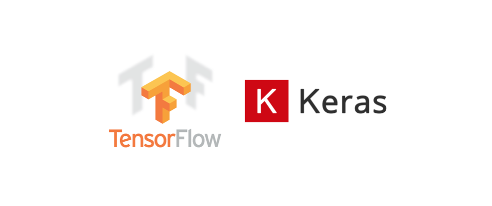

# Doctor In A Browser
           

  

# What is Doctor In A Browser?
Doctor In A Browser, as the name suggests, is like a doctor in a browser, basically in the form of a Web Application. What does this doctor do, I hear you asked? It is a diagonistic tool. As we know, diagnosis is the first step in any treatment. So, quick and accurate diagnosis can be life saving. 

So, how does it diagnose diseases? Well, it harnesses the power of Machine Learning. Machine Learning, as we know, can be used to learn complex features from data, which can be game changing in the field of disease diagnosis. 

It also produces a report, with a certificate. This report and certificate are mailed to the user for further usability and treatment. 

# Machine Learning Models Supported in Doctor In A Browser
1. **Maternal Health Chatbot** : Pregnancy is an uncertain time for the mothers carrying the foetus. A lot of questions arise in the minds of the to be mothers, especially for the first baby, which they are maybe afraid or too shy of judgement to ask others. Here is where the Maternal Health chatbot comes in. It is a Frequently Asked Questions based Chatbot on subjects such as the diet to be consumed and the physical activity to go through during the phase of Pregnancy. It will help to be mothers clear their doubts and a smoother 9 months of carrying the baby.

2. **COVID-19 Detection From CT Scan** : We have been in a pandemic situation for more than a year now. Even today we don't have a system of detecting whether a certain person is infected by COVID-19 with near perfect accuracy. We have an average error of about 0% to 30% , which can be catastrophic, especially for the false negative cases. So, we have made a COVID-19 detection model which uses the Computer Tomography Scan of the lungs to detect the presence of the deadly virus. Our model gives a testing accuracy of 88% , which is better than the existing methods. 

# Technology Stack
 We used quite a lot of languages and frameworks in this project. 

 Firstly we will have a look at the FrontEnd part of the Web Application. We used HTML, CSS and JavaScript for this part of the project, to design the look and feel of the web application.

 
 
 Now comes the Machine Learning models. We used the popular Python based framework Keras, which is built on top of the framework Tensorflow. 

 

 For the BackEnd, which basically integrates all the different FrontEnd files and the files containing the Machine Learning models, to get the predictions out of the models, we have used the Python based microframework Flask.

 
 
 # Usability of our project
 As said earlier, our project is aimed at improved diagnosis of diseases for the models we have prepared. The least we, as developers, in these testing times can do is help out the health professionals working out their, in the frontline for us day in and day out. With our certificates, when patients visit their doctor, they can skip the diagnosis step and directly move into treating patients, which in case of medical emergencies can save lives. This was for the COVID-19 detection part.
 
 The Maternal Health Chatbot will prove to be very useful for to be mothers, who might have a lot of simple questions about the diet and nutrition plan they should be following. This will also save time as asking and getting replies from a chatbot is easier and time saving than consulting a doctor, who might be busy at the time. 
 
 # Regards from the team
 Here is hoping you liked our project.
 
 Regards,
 
 
 
 Team MLXTREME
 
